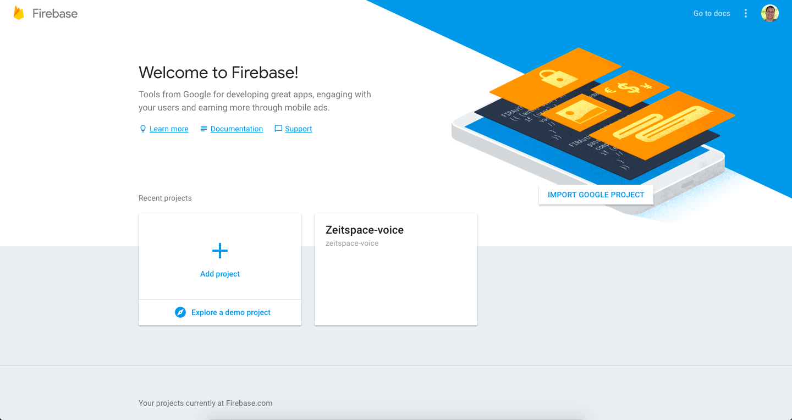
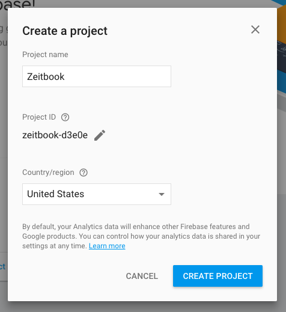
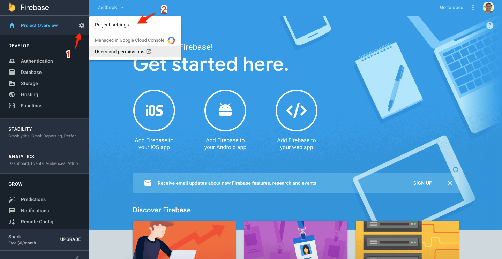
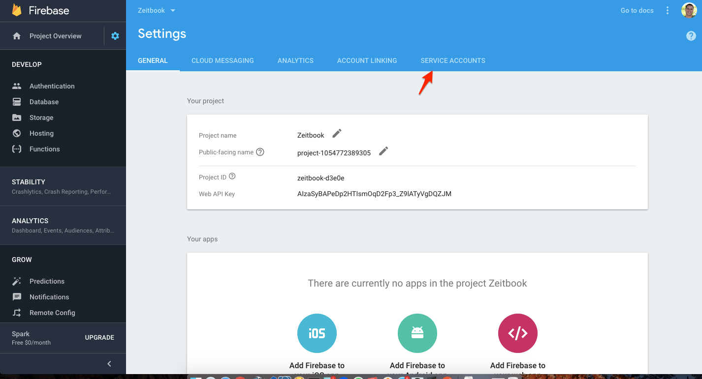
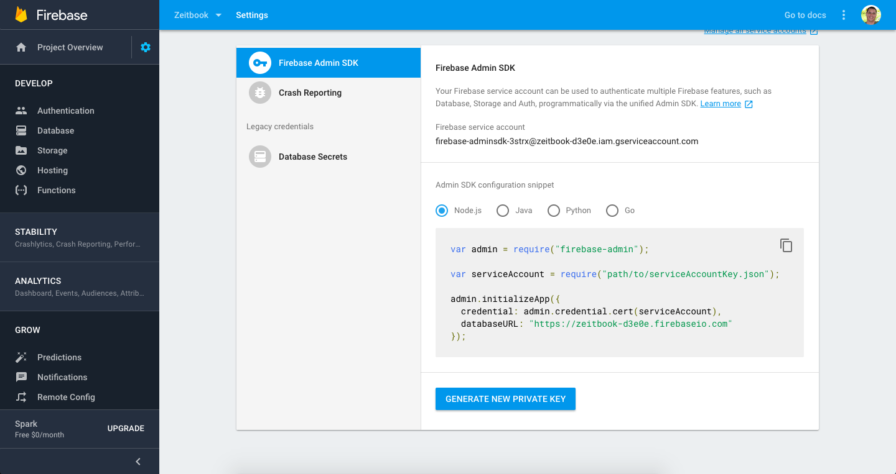
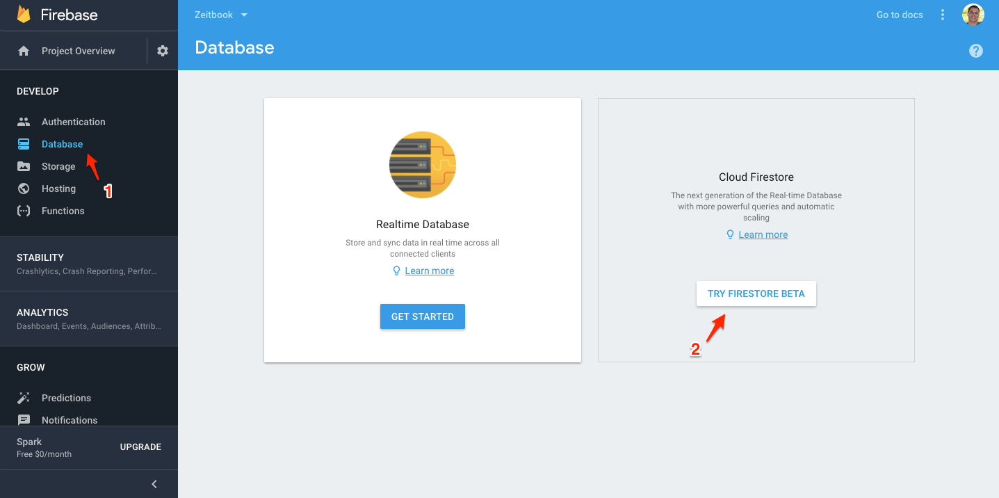
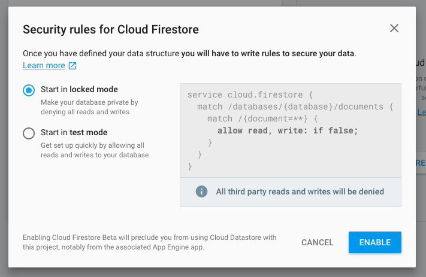

## Setup Firebase account

- Go to: https://console.firebase.google.com/u/0/

- Create new project

- Go to project settings

- Go to service accounts

- Generate new keys

- Copy downloaded file to project root
- Name it to serviceAccountKey.json

- On Firebase console, go to database

- Enable Firestore

